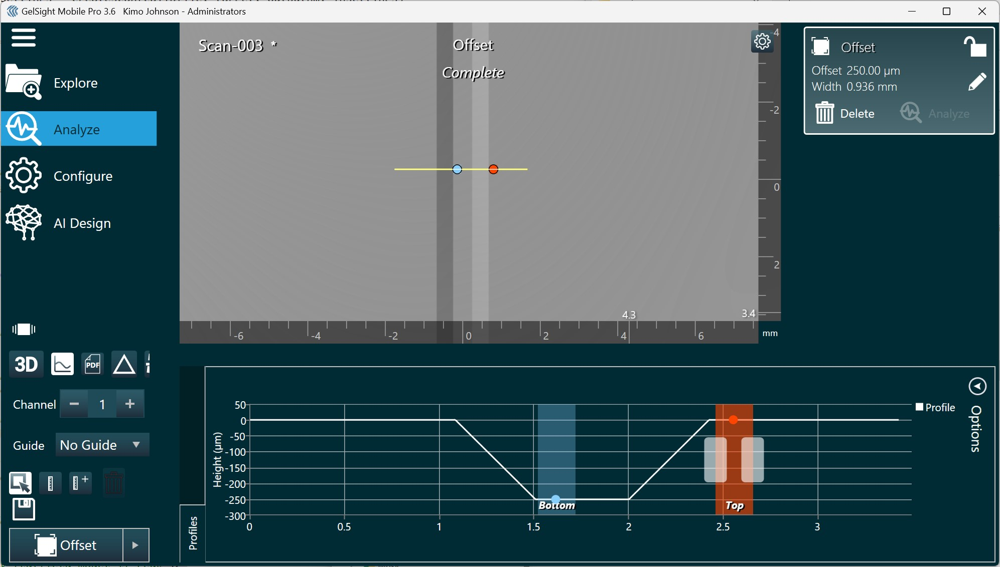

# gssim
GelSight measurement simulations for algorithm development and verification.

## Description 

This project contains MATLAB code for generating simulated GelSight scans that can be loaded into GelSight commercial software, GelSight Mobile and GSCapture, for testing measurement routines. The functions can create scans with known heightmaps (Z), sets of simulated images, along with a scan.yaml file within a scan folder. The scan folder can be added to an active library and analyzed by GelSight software.

## Prerequisites

This software is written in MATLAB and assumes the [gsmatlab](https://github.com/gelsightinc/gsmatlab) package is in your MATLAB path.

You will also need to compile the shadeQuadratic.cpp file using mex:
```
>> mex shadeQuadratic.cpp
```

## Devices

Calibration files for different GelSight devices are provided in the devices
folder. Calibration files from other devices can be added to this folder. Be
careful when renaming the files - the name of the png file is stored in a field
towards the bottom of the yaml file.  If it is renamed, the string in this field
should be changed:
```
flatfield: 
    modelfile: series2_2EF6_4JNW.png  <-- this name must match the png file name
    modelsize: (616, 514)
```

## Example Usage

### Create a scan using default parameters
Create a simulated groove scan using a Series2 calibration and save the result
in a scan folder named Scan:
```
>> createscan('series2_2EF6_4JNW', 'groove', 'Scan');
scan saved as Scan-002
```
The function `createscan` will find a unique folder name that starts with the
name provided, in this case 'Scan'. It appends a number from 001 to 999 or
returns an error if no unique folder name can be found. 

The create scan function requires a simulation function to be defined for the
type specified. In this example, the groove simulation type expects a function
named `simGroove.m` to be in the path. The inputs and outputs of simulation
functions are described below. 

### Access the parameters for a simulation type
When a scan folder is not specified, the default settings for the simulation type can be saved to a variable.
```
tsettings = createscan('series2_2EF6_4JNW', 'groove')

tsettings = 

  struct with fields:

        depthmm: 0.5000
    orientation: 'horizontal'
        widthmm: 0.5000
          angle: 30
```

### Adjust the simulation settings

Different scans can be created by modifying the simulation settings:
```
>> tsettings = createscan('series2_2EF6_4JNW', 'groove');
>> tsettings.depthmm = 0.25;
>> tsettings.orientation = 'vertical';
>> createscan('series2_2EF6_4JNW', 'groove', 'Scan', tsettings);
scan saved as Scan-003
```

### Copy to GelSight Mobile scan library

After the scan is generated, the entire scan folder can be copied into the GelSight Mobile scan library and loaded from Explore view. 



## Simulation functions

Simulation functions can be called automatically from `createscan` by following the conventions below:
- Name the function `simType` where Type is the type of surface to simulate. The function should be saved as a file named `simType.m`.
- The first argument to the function is a struct with fields sz and mmpp. The sz field is a 1 x 2 array with the number of rows and the number of columns of the heightmap. The second argument is the resolution in millimeters-per-pixel. 
- The second argument to the function is a struct that specifies the settings for this simulation function. The fields and types stored in the struct can be anything.
- There is a single output argument to the function. The output argument is equal to the default settings struct if only one input argument is provided. It is equal to the heightmap if two input arguments are provided.

See `simGroove.m` as an example of how to write a simulation function. 

### simGroove
Here is an example of how to run `simGroove`
```
% Call the function with no outputdir to get settings struct
>> st = createscan('gsmax_26D1_P5LX', 'groove');
>> st.orientation = 'vertical';

% Call createscan with the settings struct as the final argument
>> createscan('gsmax_26D1_P5LX','groove','vertical-groove',st);

% Optionally specify parameters in key-value pairs
>> createscan('gsmax_26D1_P5LX','groove','groove-1mm','depthmm',1.0);
```

The full `groove` settings struct is:

| Field | Default | Meaning |
|-------|---------|---------|
| `depthmm` | `0.5` | Depth of the groove (mm) |
| `orientation` | `'horizontal'` | `'horizontal'` or `'vertical'` |
| `widthmm` | `0.5` | Bottom width of the groove (mm) |
| `angle` | `30` | Side-wall angle relative to horizontal (degrees) |
| `geommpp` | `0` | Geometry build resolution (mm/px); `0` = use the calibrated resolution |
| `aasigma` | `0.5` | Anti-aliasing Gaussian sigma, in calibrated pixels |

#### Geometry resolution (`geommpp`)

By default the groove is built directly on the calibrated pixel grid, so its
feature widths are limited by pixel quantization. Setting `geommpp` to a value
finer than the calibrated `mmpp` builds the geometry on a higher-resolution grid,
applies an anti-aliasing Gaussian blur (controlled by `aasigma`), and resamples
back onto the calibrated grid. This gives the features sub-pixel precision, so the
measured dimensions land closer to the nominal value:

```
% Build the groove geometry at 1 µm/px before resampling to the calibration
>> st = createscan('series2_2EF6_4JNW', 'groove');
>> st.geommpp = 0.001;
>> createscan('series2_2EF6_4JNW', 'groove', 'Scan', st);
```

The fine-grid path is only used when it oversamples the calibration by at least
1.5x (`mmpp / geommpp >= 1.5`); for coarser values the oversampling is too small
for the anti-aliasing to help and `simGroove` falls back to the original method.
Finer `geommpp` gives smaller error at the cost of more computation; values around
`mmpp/4` to `mmpp/7` are a good balance.

### simScanFromHeightmap
The `simScanFromHeightmap` function creates a scan folder with images and normal map from an existing heightmap. The parameters are
- `scandr` The path to the scan folder
- `filenm` The name of the tmd file within the scan folder

```
% Specify parameters as key-value pairs
>> createscan('gsmax_26D1_P5LX', 'scanFromHeightmap', 'testscan', 'scandr', 'path_to_scan', 'filenm', 'heightmap.tmd');
```

## Tests

Unit tests live in the `tests/` folder and use MATLAB's `matlab.unittest`
framework. `tests/testGrooveWidth.m` verifies the edge-to-edge width of a
generated groove scan using sub-pixel edge detection (`grooveEdgeToEdge.m`): it
confirms that a groove built at the calibrated resolution is measurably off the
nominal 0.5 mm, and that enabling `geommpp` brings the measured width much
closer to nominal.

Run the groove tests from the project root with the convenience runner:
```
>> runGrooveTests
```

or call `runtests` directly (note the `.m` extension is required when passing a
path, otherwise MATLAB cannot resolve the file into a test suite):
```
>> runtests('tests/testGrooveWidth.m')   % a single test file
>> runtests('tests')                     % every test in the folder
```

The tests create temporary scan folders in the project root and remove them when
finished. `grooveEdgeToEdge(scanpath, tset)` can also be called on its own to
measure the groove width in any existing scan folder.


