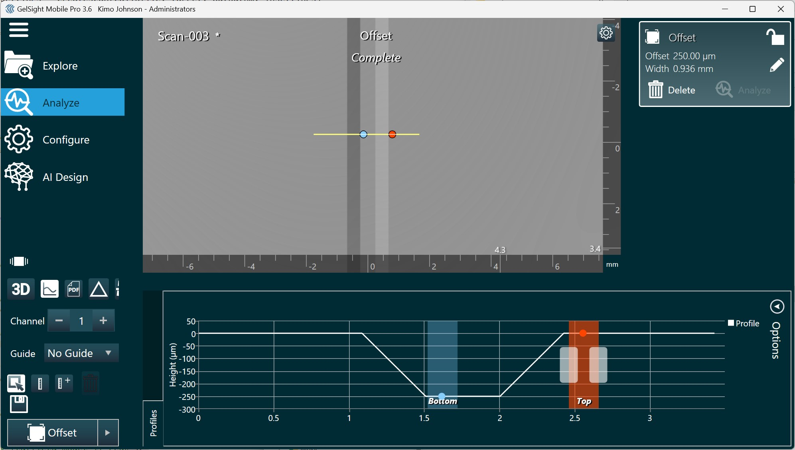

# gssim
GelSight measurement simulations for algorithm development and verification.

## Description 

This project contains MATLAB code for generating simulated GelSight scans that can be loaded into GelSight commercial software, GelSight Mobile and GSCapture, for testing measurement routines. The functions can create scans with known heightmaps (Z), sets of simulated images, along with a scan.yaml file within a scan folder. The scan folder can be added to an active library and analyzed by GelSight software.

## Prerequisites

This software is written in MATLAB and assumes the [gsmatlab](https://github.com/gelsightinc/gsmatlab) package is in your MATLAB path.

You will also need to compile the shadeQuadratic.cpp file using mex. 
```
>> mex shadeQuadratic.cpp
```

## Devices

Calibration files for different GelSight devices are provided in the devices
folder. Calibration files from other devices can be added to this folder. Be
careful when renaming the files - the name of the png file is stored in a field
towards the bottom of the yaml file.  If it is renamed, the string in this field
should be changed:
```
flatfield: 
    modelfile: series2_2EF6_4JNW.png  <-- this name must match the png file name
    modelsize: (616, 514)
```

## Example Usage

### Create a scan using default parameters
Create a simulated groove scan using a Series2 calibration and save the result
in a scan folder named Scan:
```
>> createscan('series2_2EF6_4JNW', 'groove', 'Scan');
scan saved as Scan-002
```
The function `createscan` will find a unique folder name that starts with the
name provided, in this case 'Scan'. It appends a number from 001 to 999 or
returns an error if no unique folder name can be found. 

The create scan function requires a simulation function to be defined for the
type specified. In this example, the groove simulation type expects a function
named `simGroove.m` to be in the path. The inputs and outputs of simulation
functions are described below. 

### Access the parameters for a simulation type
When a scan folder is not specified, the default settings for the simulation type can be saved to a variable.
```
tsettings = createscan('series2_2EF6_4JNW', 'groove')

tsettings = 

  struct with fields:

        depthmm: 0.5000
    orientation: 'horizontal'
        widthmm: 0.5000
          angle: 30
```

### Adjust the simulation settings

Different scans can be created by modifying the simulation settings:
```
>> tsettings = createscan('series2_2EF6_4JNW', 'groove');
>> tsettings.depthmm = 0.25;
>> tsettings.orientation = 'vertical';
>> createscan('series2_2EF6_4JNW', 'groove', 'Scan', tsettings);
scan saved as Scan-003
```

### Copy to GelSight Mobile scan library

After the scan is generated, the entire scan folder can be copied into the GelSight Mobile scan library and loaded from Explore view. 



